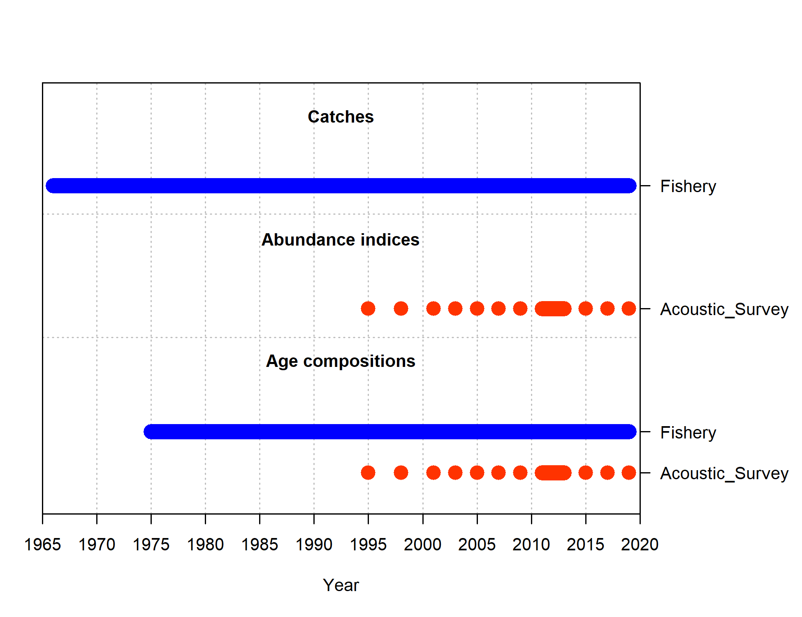

<!--chapter:end:00a.Rmd-->

---
author:
  - name: Jason M. Cope
    code: 1
    first: J
    middle: M
    family: Cope
  - name: Alison D. Whitman
    code: 2
    first: A
    middle: D
    family: Whitman
author_list: Cope, J.M., A.D. Whitman
affiliation:
  - code: 1
    address: Northwest Fisheries Science Center, U.S. Department of Commerce, National
      Oceanic and Atmospheric Administration, National Marine Fisheries Service, 2725
      Montlake Boulevard East, Seattle, Washington 98112
  - code: 2
    address: Oregon Department of Fish and Wildlife, 2040 Southeast Marine Science
      Drive, Newport, Oregon 97365
address:
  - ^1^Northwest Fisheries Science Center, U.S. Department of Commerce, National Oceanic
    and Atmospheric Administration, National Marine Fisheries Service, 2725 Montlake
    Boulevard East, Seattle, Washington 98112
  - ^2^Oregon Department of Fish and Wildlife, 2040 Southeast Marine Science Drive,
    Newport, Oregon 97365
---

<!--chapter:end:00authors.Rmd-->

---
title: Status of Vermilion rockfish (_Sebastes miniatus_) along the US West - Oregon
  coast in 2021
---

<!--chapter:end:00title.Rmd-->

\vspace{500cm}

# Disclaimer{-}

_**These materials do not constitute a formal publication and are for information only. They are in a pre-review, pre-decisional state and should not be formally cited or reproduced. They are to be considered provisional and do not represent any determination or policy of NOAA or the Department of Commerce.**_

\pagebreak
\pagenumbering{roman}
\setcounter{page}{1}

\renewcommand{\thetable}{\roman{table}}
\renewcommand{\thefigure}{\roman{figure}}


\setlength\parskip{0.5em plus 0.1em minus 0.2em}

<!--chapter:end:01a.Rmd-->

```{r executive, echo = FALSE}
executive <- list()
executive[["stock"]] <- paste0("This assessment reports the status of ",
  spp, " (_", spp.sci, "_) off the ", coast, 
  " coast using data through xxxx.")
```
# Executive Summary{-}
## Stock{-}
`r executive[["stock"]]`

## Landings{-}
Replace text.

## Data and Assessment{-}
Replace text.

## Stock Biomass{-}
Replace text.

## Recruitment{-}
Replace text.

## Exploitation Status{-}
Replace text.

## Reference Points{-}
Replace text.

## Management Performance{-}
Replace text.

## Unresolved Problems and Major Uncertainties{-}
Replace text.

## Decision Table{-}
Replace text.

## Research and Data Needs{-}
Replace text.

<!--chapter:end:01executive.Rmd-->

\pagebreak
\setlength{\parskip}{5mm plus1mm minus1mm}
\pagenumbering{arabic}
\setcounter{page}{1}
\renewcommand{\thefigure}{\arabic{figure}}
\renewcommand{\thetable}{\arabic{table}}
\setcounter{table}{0}
\setcounter{figure}{0}

\setlength\parskip{0.5em plus 0.1em minus 0.2em}

<!--chapter:end:10a.Rmd-->

# Introduction
## Basic Information
`r executive[["stock"]]`

## Life History
Replace text.

## Ecosystem Considerations
Replace text.

## Historical and Current Fishery Information
Replace text.

## Summary of Management History and Performance
Replace text.


<!--chapter:end:11introduction.Rmd-->

# Data
A description of each data source is provided below (Figure \ref{fig:data-plot}).

<!--chapter:end:20data.Rmd-->

## Fishery-Dependent Data

<!--chapter:end:21f-.Rmd-->

## Fishery-Independent Data

<!--chapter:end:21s-.Rmd-->

### \acrlong{s-aslope}

The \gls{s-aslope} operated during the months of October to November aboard the R/V _Miller Freeman_.
Partial survey coverage of the US west coast occurred during the years 1988-1996 and complete coverage (north of 34\textdegree 30\textquotesingle S) during the years 1997 and 1999-2001.
Typically, only these four years that are seen as complete surveys are included in assessments.

<!--chapter:end:21s-aslope.Rmd-->

### \acrlong{s-tri}

The \gls{s-tri} was first conducted by the \gls{afsc} in 1977, and the survey continued until 2004 [@weinberg_2001_2002].
Its basic design was a series of equally-spaced east-to-west transects across the continential shelf from which searches for tows in a specific depth range were initiated.
The survey design changed slightly over time.
In general, all of the surveys were conducted in the mid summer through early fall.
The 1977 survey was conducted from early July through late September.
The surveys from 1980 through 1989 were conducted from mid-July to late September.
The 1992 survey was conducted from mid July through early October.
The 1995 survey was conducted from early June through late August.
The 1998 survey was conducted from early June through early August.
Finally, the 2001 and 2004 surveys were conducted from May to July.

Haul depths ranged from 91-457 m during the 1977 survey with no hauls shallower than 91 m.
Due to haul performance issues and truncated sampling with respect to depth, the data from 1977 were omitted from this analysis.
The surveys in 1980, 1983, and 1986 covered the US West Coast south to 36.8\textdegree N latitude and a depth range of 55-366 m.
The surveys in 1989 and 1992 covered the same depth range but extended the southern range to 34.5\textdegree N (near Point Conception).
From 1995 through 2004, the surveys covered the depth range 55-500 m and surveyed south to 34.5\textdegree N.
In 2004, the final year of the \gls{s-tri} series, the \gls{nwfsc} \gls{fram} conducted the survey following similar protocols to earlier years.

<!--chapter:end:21s-tri.RMd-->

### \acrlong{s-wcgbt}

The \Gls{s-wcgbt} is based on a random-grid design;
covering the coastal waters from a depth of 55-1,280 m [@bradburn_2003_2011].
This design generally uses four industry-chartered vessels per year assigned to a roughly equal number of randomly selected grid cells and divided into two 'passes' of the coast.
Two vessels fish from north to south during each pass between late May to early October.
This design therefore incorporates both vessel-to-vessel differences in catchability,
as well as variance associated with selecting a relatively small number (approximately 700) of possible cells from a very large set of possible cells spread from the Mexican to the Canadian borders.

<!--chapter:end:21s-wcgbts.Rmd-->

## Biological Data


### Growth (Length-at-Age)

The length-at-age was estimated for female and male `r spp` using data collected from fishery-independent data sources off the coast of California that were collected from 2004-2019 (Table \ref{tab:len-at-age-samps} and Figure \ref{fig:len-age-data}). Males are smaller than females, but much less susceptible to capture by hook and line, so the trawl fishery provided an important source of small individuals. Figure \ref{fig:len-age} shows the lengths and ages for all years by data source as well as predicted von Bertalanffy fits to the data. Females grow larger than males and sex-specific growth parameters were estimated at the following values:

\begin{centering}

Females $L_{\infty}$ = `r round(model$MGparmAdj$L_at_Amax_Fem_GP_1[1], 1)` cm; $k$ = `r round(model$MGparmAdj$VonBert_K_Fem_GP_1[1], 3)`; $t_0$ = `r round(model$Growth_Parameters[1,10], 2)`

Males $L_{\infty}$ = `r round(model$MGparmAdj$L_at_Amax_Mal_GP_1[1], 1)` cm; $k$ = `r round(model$MGparmAdj$VonBert_K_Mal_GP_1[1], 3)`; $t_0$ = `r round(model$Growth_Parameters[2,10], 2)`

\end{centering}

\vspace{0.5cm}

The length-at-age by sex and the coefficient of variation by size used in the model is shown in Figure \ref{fig:len-age-ss}.


### Ageing Precision and Bias


### Maturation and Fecundity

Maturity-at-length based on the work of Love et al [-@love_life_1990] which estimated the 50 percent size-at-maturity of `r round(model$MGparmAdj[,"Mat50%_Fem_GP_1"][1],2)` cm off the coast of California, though the slope of the maturity curve was not estimated. Most rockfishes have slopes somewhere between -0.6 and -1 (though some go down to -0.25). In the absence of a literature value of `r round(model$MGparmAdj$Mat_slope_Fem_GP_1[1], 2)` was assumed. A sensitivity run using -0.6 was also explored and showed essentially no change in results. Maturity was assumed to stay asymptotic for larger fish (Figure \ref{fig:maturity}). 

The fecundity-at-length was based on research by Dick et al.[-@dick_meta-analysis_2017]. The fecundity relationship for `r spp` was estimated equal to $Fec$=`r format(model$MGparmAdj$Eggs_scalar_Fem[1], scientific = TRUE)`$L$^`r round(model$MGparmAdj$Eggs_exp_len_Fem[1],2)`^ in millions of eggs where $L$ is length in cm. Fecundity-at-length is shown in Figure \ref{fig:fecundity}.


### Natural Mortality

Natural mortality was not directly measured, so life-history based empirical relationships were used. The Natural Mortality Tool (NMT; https://github.com/shcaba/Natural-Mortality-Tool), a Shiny-based graphical user interface allowing for the application of a variety of natural mortality estimators based on measures such as longevity, size, age and growth, and maturity, was used to obtain estimates of natural mortality. The NMT currently provides 19 options, including the Hamel [-@hamel_method_2015] method, which is a corrected form of the Then et al. [-@then_evaluating_2015-1] functional regression model and is a commomly applied method for west coast groundfish. The NMT also allows for the construction of a natural mortality prior weighted across methods by the user. 

 We assumed the age of 45 years to represent the practical longevity for both females and males based on 90% of the age of the oldest sampled individual (a 50 year old female; oldest male was 49), as was done in the 2015 yelloweye assessement [@gertseva_stock_2017]. Empirical $M$ estimators using the von Bertalanffy growth parameters were also considered (Figure \ref{fig:M_female}), but they produced unreasonably high estimates (2-3 times higher than the longevity estimates). This is likely explained by the fact that while `r spp` are a smaller rockfish species, they still have protracted longevity comparable to stocks that are twice their maximum size. Additionally, the FishLife [@thorson_predicting_2017] estimate was included, though, given the source of FishLife data is FishBase, there is a good chance the estimates of $M$ are also from methods using longevity, though the actual value of longevity used was unknown. The final composite $M$ distributionn (Figure \ref{fig:M_composite_dists}) are based on 4 empirical estimators, and result in a median value of 0.133 (mean of 0.136), with a CV of 0.22. We explore sensitivity to these assumptions of natural mortality through likelihood profiling.


### Length-Weight Relationship

The length(cm)-weight(kg) relationship for `r spp` was estimated outside the model using all coastwide biological data available from fishery-independent data sources. The estimated length-weight relationship for female fish was $W$=`r format(model$MGparmAdj$Wtlen_1_Fem[1], scientific = TRUE)`$L$^`r round(model$MGparmAdj$Wtlen_2_Fem[1],2)`^ and males at $W$=`r format(model$MGparmAdj$Wtlen_1_Mal[1], scientific = TRUE)`$L$^`r round(model$MGparmAdj$Wtlen_2_Mal[1], 2)`^ (Figures \ref{fig:len-weight}).


### Sex Ratio

No information on the sex ratio at birth was available so it was assumed to be 50:50. 


### Steepness

The Thorson-Dorn rockfish prior (developed for use West Coast rockfish assessments) conducted by James Thorson (personal communication, NWFSC, NOAA) and reviewed and endorsed by the Scientific and Statistical Committee (SSC) in 2017, has been a primary source of information on steepness for rockfishes. This approach, however, was subsequently rejected for future analysis in 2019 when the new meta-analysis resulted in a mean value of approximately 0.95. In the absense of a new method for generating a prior for steepness the default approach reverts to the previously endorsed method, the 2017 prior for steepness ($h$; beta distribution with $\mu$=`r round(model$parameters[model$parameters$Label == "SR_BH_steep","Value"],2)` and $\sigma$=0.15) is retained.  


<!--chapter:end:22biology.Rmd-->

## Environmental and Ecosystem Data

<!--chapter:end:23enviro.Rmd-->

# Assessment Model


<!--chapter:end:30model.Rmd-->

## Summary of Previous Assessments and Reviews


### History of Modeling Approaches (not required for an update assessment)


### Most Recent STAR Panel and SSC Recommendations (not required for an update assessment)


### Response to Groundfish Subcommittee Requests (not required in draft)

<!--chapter:end:31summary.Rmd-->

## Model Structure and Assumptions


### Model Changes from the Last Assessment (not required for an update assessment)


### Modeling Platform and Structure
General model specifications (e.g., executable version, model structure, definition of fleets and areas)


### Model Parameters
Describe estimated vs. fixed parameters, priors

### Key Assumptions and Structural Choices

<!--chapter:end:32structure.Rmd-->

## Base Model Results


### Parameter Estimates

### Fits to the Data

### Population Trajectory

### Reference Points


<!--chapter:end:33results.Rmd-->

## Model Diagnostics
Describe all diagnostics

### Convergence

### Sensitivity Analyses

### Retrospective Analysis

### Likelihood Profiles

### Unresolved Problems and Major Uncertainties

<!--chapter:end:34diagnostics.Rmd-->

# Management 

## Reference Points

## Unresolved Problems and Major Uncertainties

## Harvest Projections and Decision Tables

## Evaluation of Scientific Uncertainty

## Research and Data Needs

<!--chapter:end:40management.Rmd-->

# Acknowledgments
Here are all the mad props!

<!--chapter:end:41acknowledgments.Rmd-->

\clearpage

# References
<!-- If you want to references to appear somewhere before the end, add: -->
<div id="refs"></div>
<!-- where you want it to appear -->
<!-- The following sets the appropriate indentation for the references
  but it cannot be used with bookdown and the make file because it leads
  to a bad pdf.
\noindent
\vspace{-2em}
\setlength{\parindent}{-0.2in}
\setlength{\leftskip}{0.2in}
\setlength{\parskip}{8pt}
 -->

<!--chapter:end:49bibliography.Rmd-->

\clearpage
# Tables


<!--chapter:end:52tables.Rmd-->

\clearpage
# Figures

{width=100% height=100% alt="Summary of data sources used in the base model"}

<!--chapter:end:53figures.Rmd-->

